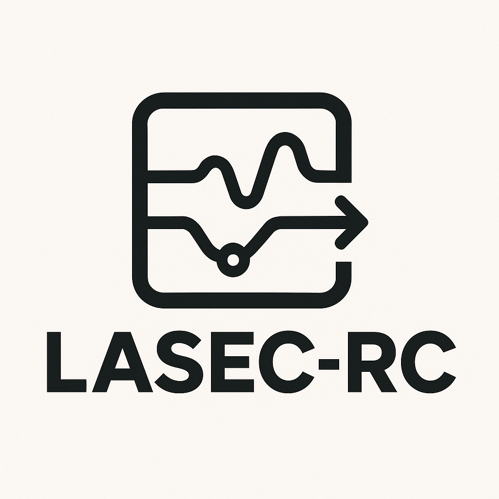
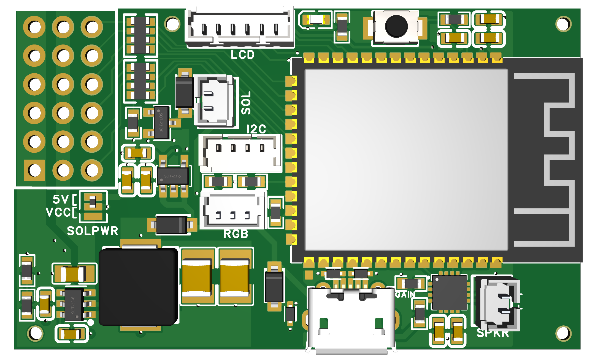
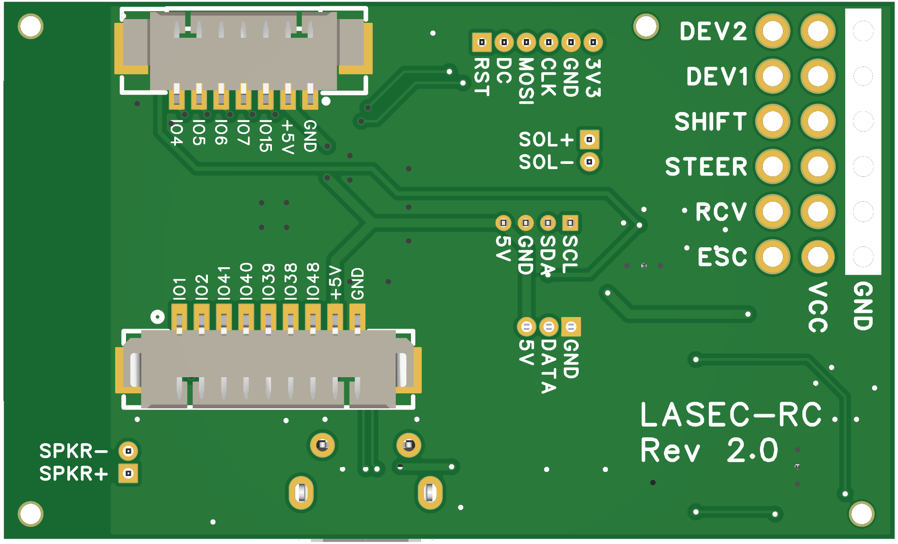

# LASEC-RC (Light, Audio, Servo, ESC Control)



LASEC-RC is an open-source control system for RC trucks and similar vehicles. It is built around the ESP32-S3 and combines drive control, lighting, audio output, and BLE-based configuration in one project. The firmware is aimed at custom truck builds where a single controller manages both the vehicle logic and the vehicle sound and lighting behavior. It does not drive the motor directly; it controls the motor through an external ESC. This project is not a ready-to-use product; it is intended more as a versatile development board and platform for custom builds.

## Overview

The project centers on a custom PCB designed for an ESP32-S3 module. That board includes power and signal routing for steering, ESC control, lighting, audio, and receiver input. The firmware runs on ESP-IDF and FreeRTOS and uses the ESP32's dual-core architecture to separate time-sensitive control work from other tasks such as audio playback and BLE communication.

The system is designed for RC vehicles that need more than simple forward/reverse control. It supports channel mapping from the radio receiver, drivetrain simulation, auxiliary outputs, and several vehicle-specific functions such as lights and sound events.

## Hardware

The PCB is defined in the EasyEDA project `lasec-rc-easyeda.epro2` and is built around the ESP32-S3-WROOM-1 (N16R8) module.

### Board images

<p>
  
  
</p>

Schematics: [SCH_LASEC-RC_2026-08-25.pdf](hardware/SCH_LASEC-RC_2026-08-25.pdf)

### Local sound test

The project includes a local sound simulator that runs on Linux and can be used to test the sound logic without flashing the board.

```bash
cd /home/dwi/projects/privat/truck/LASEC-RC
bash tools/build_sound_simulator.sh
cd tools
./sound_simulator
```

Keyboard controls are defined in [tools/sound_simulator.cpp](/home/dwi/projects/privat/truck/LASEC-RC/tools/sound_simulator.cpp):
- `w / s` = throttle up/down
- `j / l` = steering left/right
- `c` = clutch
- `h` = horn
- `z` = hazard
- `1 / 2 / 3` = gear change
- `q` = quit

This is useful for checking engine tone, gear shift sounds, air brake effects, and horn logic before running on hardware.

### Main hardware features

- MCU: ESP32-S3 with dual-core processing, WiFi, and BLE.
- Power regulation: a TPS54302 step-down converter is used to convert the input supply to the board's regulated 5V voltage rails.
- Compact PCB layout for tight installation space in RC trucks.
- Generic I/O headers for custom wiring. These pins are connected directly to the ESP32 and are not protected against overvoltage or reverse polarity.
- I2C expansion header for custom modules. It is not limited to lighting; lighting is simply one example used in this truck build.
- UART receiver input. In the HoTT SUMD case, this is used as a UART serial port. The same port can also be repurposed for other receiver protocols in other builds.
- ESC outputs with high-resolution PWM for motor control.
- Servo outputs for steering, gear shifts, and auxiliary functions. The `dev1` and `dev2` slots on the main connector are available for additional custom servo connections.
- Solenoid or driver output on a dedicated `5th_wheel / solenoid` connection using an IRLML2502 N-channel MOSFET. This output is intended for inductive loads such as a solenoid, trailer coupler release, or shaker motor. A DSS34 Schottky diode is included for flyback suppression.
- Audio stage based on a MAX98357 amplifier connected over I2S. This is used for engine tones, horn sounds, braking sounds, and other vehicle audio effects.

## Firmware and software

The firmware is built with ESP-IDF and FreeRTOS. It uses a modular structure to handle real-time control, audio generation, and BLE configuration in parallel.

### Engine and audio simulation

The engine model calculates RPM from throttle input, vehicle speed, gear selection, and drivetrain load. The resulting values drive engine sound generation and engine-related behavior. The project includes a sound engine that reads `.wav` files from the internal SPIFFS filesystem and plays them with the configured timing and volume.

Before audio can be uploaded to the board, the `.wav` files must first be prepared in the `sounds/` directory. In PlatformIO, run the custom task `Generate Audio Pack` from the `Custom` section to package the sound files into the build output. Then run `Upload Audio Pack` to write the generated audio payload to the matching partition on the device.

The current repository includes sound files for the Mercedes-Benz Actros MP4 engine and related systems. Sound events include start and stop behavior, turbo effects, air brake sounds, horn output, and gear shifting audio.

> A portion of the engine mass simulation, RPM calculation, and sound-processing logic is based on fantastic work from [Rc_Engine_Sound_ESP32](https://github.com/TheDIYGuy999/Rc_Engine_Sound_ESP32) by TheDIYGuy999. This project builds on that work for a compact, custom hardware platform and keeps the current receiver support focused on the HoTT SUMD protocol.

### Drivetrain and control logic

The drivetrain logic models a virtual clutch and gearbox with up to three gears. The control system ties engine RPM to gear changes and vehicle speed so the truck behaves more like a real model than a simple RC drive train.

Acceleration and braking are handled through inertia simulation, which gives the vehicle a more natural response to throttle changes and load. The drive state machine tracks states such as standing, driving forward, braking, and reversing, and transitions between them based on user input and safety conditions.

### Lighting system

The lighting system can control low beam, high beam, fog lights, daytime running lights, parking lights, reverse lights, and brake lights. It also supports turn signal behavior that can be automatic or manually triggered, with optional audio clicks synchronized with the indicator state.

The project includes WS2812 RGB support for custom LED effects and underglow lighting. This gives the truck a way to add custom visual feedback beyond the standard vehicle lights.

### Receiver support and failsafe

The current radio receiver support is focused on the HoTT SUMD protocol. Channel mapping is handled in firmware so the controller can match receiver inputs to specific vehicle functions such as steering, throttle, gear shift, and auxiliary control.

A failsafe function is included to stop the vehicle and apply braking if the radio link is lost.

### BLE configuration interface

The truck exposes a BLE GATT service that can be connected to a configuration interface. Through that interface, it is possible to map channels, tune ESC and servo endpoints, adjust RGB colors, and change sound volume without flashing new firmware.

Configuration values are stored in the ESP32's NVS area so they remain available after a restart.

## Project structure

- `hardware/`: EasyEDA PCB project files.
- `include/` and `src/`: C++ firmware sources for ESP-IDF and FreeRTOS.
- `data/` and `sounds/`: SPIFFS image and raw audio files used by the sound system.
- `lib/`: External dependencies and custom libraries.

## Building and flashing

This project uses PlatformIO with the ESP-IDF framework.

1. Install PlatformIO.
2. Prepare the required `.wav` files in `sounds/`.
3. Build the project with `pio run`.
4. In PlatformIO, run the custom task `Generate Audio Pack` from the `Custom` section. This packages the sound files into the project build output.
5. Upload the firmware with `pio run -t upload`.
6. Run `Upload Audio Pack` to write the generated audio data to the board's audio partition.
7. Build and upload the SPIFFS filesystem for general data with:
   - `pio run -t buildfs`
   - `pio run -t uploadfs`

## Notes

This project is still focused on a specific hardware and control approach. The current receiver support is limited to HoTT SUMD, and the asset set in the repository currently matches the Mercedes-Benz Actros MP4 sound package. That said, the firmware structure is arranged to support further expansion for additional vehicle types, channels, and sound sets.
